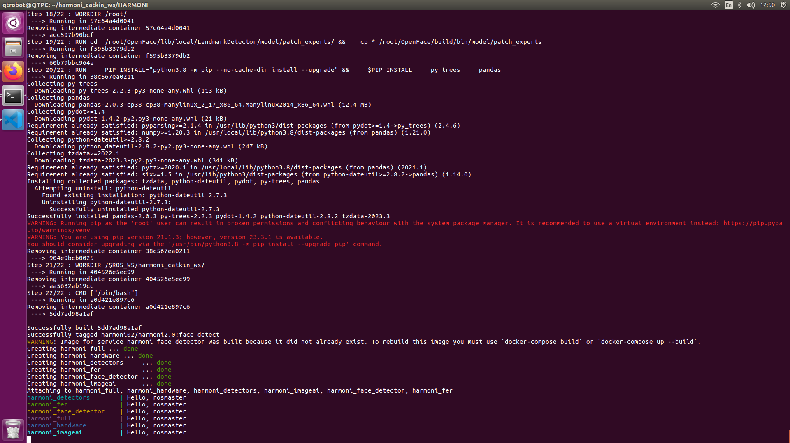
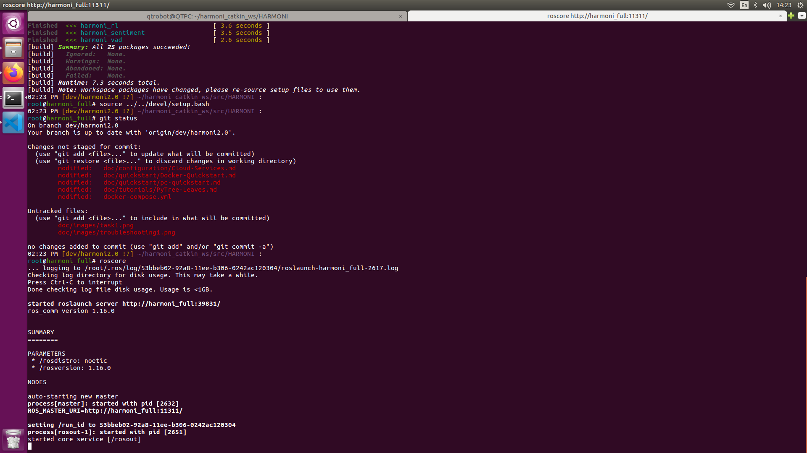
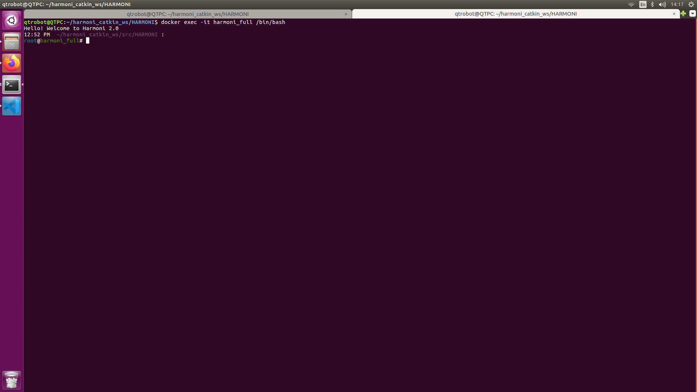

# Docker Setup[recommended]

## Setup

To complete these steps you will need to have docker working on your machine. We recommend you follow the steps here: [https://docs.docker.com/engine/install/ubuntu/](https://docs.docker.com/engine/install/ubuntu/) and verify your install with:
```bash
sudo docker run hello-world
```

To avoid entering sudo, run the following:
```bash
sudo usermod -aG docker ${USER}
su - ${USER}
```

You will also need to install docker-compose. Instructions can be found here: [https://docs.docker.com/compose/install/](https://docs.docker.com/compose/install/).

Note that if you have already installed the version V1 of docker compose, we recommend to update it to V2. Update scripts to use Compose V2 by replacing the hyphen (-) with a space, using docker compose instead of docker-compose.

## HARMONI Install

1. Clone the repository:
   ```bash
   git clone https://github.com/micolspitale93/HARMONI.git
   cd HARMONI
   git checkout dev/harmoni2.0
   ```


2. **(optional)** Pull the containers:

    You may either build or pull containers to run harmoni. Pulling containers is generally faster and can be done as:

    ```bash
    docker pull harmoni02/harmoni2.0:full
    ```

    *Note: If you would like to use all the containers we have provided a script in dockerfiles/pull_images.sh for getting all the current images, which includes both kinetic and noetic. If you run a compose file without pulling, the images will be automatically built.*

    For additional information on building or running harmoni containers, see dockerfiles/README.md.

3. **(optional)** Some Harmoni interactions require accounts with cloud services (Such as Amazon Polly). If you do not already have them set up, set up cloud services/keys. Instructions are in the [Cloud Services section](../configuration/Cloud-Services).


## Run HARMONI

1. **(optional)** In order to run with window forwarding on linux use:
   ```bash
   xhost +local:
   ```

   Note: For Windows you will need to set up docker with WSL2


2. Use docker compose to launch the complete system (will build if necessary, use --build to force):
   ```bash
   docker compose -f docker-compose-basic.yml up
   ``` 
   *Note: If you would like to install the full HARMONI V2 modules, you need 20 GB of space. The image pulling and compose of the container will take around 2 hours (depending on your internet connection). In can you want to pull and build all the available HARMONI images you should run: `docker compose -f docker-compose.yml up`

   If the terminal prints: "Hello, rosmaster", you successfully setup the HARMONI full container.  
   If you have pulled and run the docker compose correctly, you should see something as follows:
   

   *Note: We provide a bash script for launching multiple containers called run_compose.sh*
   

3. Open a new terminal. To get into this container, you will need to run the following to mount a terminal into the container:
   ```bash
   docker exec -it harmoni_full bash
   ``` 
   *Note: if you wish to connect to other containers, simply replace harmoni_full with the other containers name, e.g. harmoni_hardware*  

   If this is successful, you will see:
   ```bash
   Hello! Welcome to Harmoni 2.0
   11:47 AM [develop] ~/harmoni_catkin_ws/src/HARMONI :
   root@harmoni_full# 
   ``` 
  
4. Then change the branch to set it to HARMONI 2.0 with the following command:
   ```bash
   git checkout dev/harmoni2.0
   ```
   *Note: If you cannot see [dev/harmoni2.0], please follow the instructions in the Troubleshooting section below (step 1)

5. Make sure that all the packages are build correctly. Build all the packages following these commands:
   ```bash
   catkin build
   source ../../devel/setup.bash
   ``` 
6. From this point you may launch `roscore` or any other ros or harmoni command. 
   *Note: You will need to do this step for every process you wish to run in the container. If multiple terminal processes are required, you will need to connect multiple terminals to the docker instance with the docker exec command above*  
   If the `roscore` run is successful, you will see:
   ```bash
   started core service [/rosout]
   ```
   


If you want to use also the other containers, repeat the same process, and remeber to build (step 5) the catking packages in all containers opened.

You are now set up for Harmoni with Docker! Check on your [configuration here](../Configuration) and then [start some services here](../tutorials/Launching-Services).

## Troubleshooting
1. If you cannot see [dev/harmoni2.0], and you see the screen below:
   
   Please run the following commands:
   ```bash
   git config --global --add safe.directory /root/harmoni_catkin_ws/src/HARMONI
   ```
