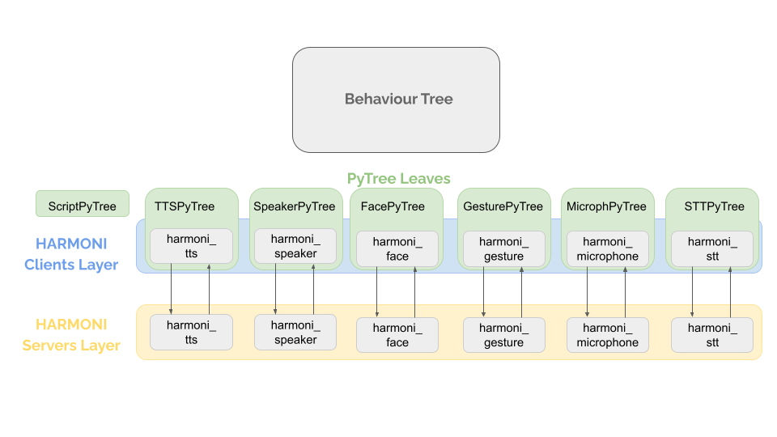

# Compose Interaction

_This example uses the sequential pattern player found in the harmoni_pattern package._


_An example interaction script pictured as a behavior tree._

## Interaction Creation with PyTree
HARMONI enables to compose an interaction very easily. The interaction consists of different steps, that can be ran all together, or they can wait for another action to accomplish.

PyTree is one among the several ways to implement behaviour trees.

A tree in pytree is made of two elements: nodes and leaves. Nodes can be of different nature but in general they belong to the family of composites (sequence, parallel, selector). The management of these elements it’s not something that users have to do, everything has already been done by the creators of pytree. Leaves come from a single element called “behaviour” and these are the components that users can create. Even if pytree made some basic behaviours available for us (you can find some of them here), developers are required to create their own behaviours (skeleton of behaviour). We provide some leaves that represent the pytree version of clients of HARMONI.

The execution of a tree is done by ticking it.<br />
A tick starts from the root and then is propagated down in the tree up to leaves. Leaves will perform their tasks and in the end compute a state that will be returned and propagated back until the root.<br />
As mentioned before a tree is composed of nodes and leaves. Since all the leaves are behaviours that have their own class we suggest creating a different script for the body that will import all the behaviours that it needs (an example [here](https://py-trees.readthedocs.io/en/devel/trees.html#skeleton))
You can notice that after creating the tree all you need to do is call the function `behaviour_tree.tick_tock()` that will take care of ticking the tree. Parameters `pre_tick_handler` and `post_tick_handler` are used to lick functions that will be executed respectively before and after the tickling of the tree. In general they are used to see the status of the tree and additional information like the content of the blackboards.
We suggest adding a special element of the family of visitors that is called *snapshot visitor*. This component is used combined with `display.unicode_tree` to also show the statue of the visited element in the tree.<br />
You can add it by adding the following lines in the declaration of the behaviour tree

```  
snapshot_visitor = py_trees.visitors.SnapshotVisitor()
behaviour_tree.visitors.append(snapshot_visitor)
```
and then adding in the parameter `visited` in `dispaly.unicode_tree`  like that

```  
py_trees.display.unicode_tree(
            root=behaviour_tree.root,
            visited=snapshot_visitor.visited)
```
You can also decide to manually tick the tree by running `behaviour_tree.tick()` instead of `tick_tock()` function. 
PyTree offers a lot of components and useful tools that developers can use in their trees but here we will mention **composites** and **blackboards**. We recommend reading the documentation for understand all the concepts:   [https://py-trees.readthedocs.io/en/devel/behaviours.html](https://py-trees.readthedocs.io/en/devel/behaviours.html)

#### Composites

Composites are responsible for directing the path traced through the tree on a given tick (execution). They are the factories (Sequences and Parallels) and decision makers (Selectors) of a behaviour tree.
Composite behaviours typically manage children and apply some logic to the way they execute and return a result, but generally don’t do anything themselves. Perform the checks or actions you need to do in the non-composite behaviours.
[https://py-trees.readthedocs.io/en/devel/composites.html#composites](https://py-trees.readthedocs.io/en/devel/composites.html#composites)

#### Blackboards

Blackboards are not a necessary component of behaviour tree implementations, but are nonetheless, a fairly common mechanism for sharing data between behaviours in the tree.
[https://py-trees.readthedocs.io/en/devel/blackboards.html#blackboards](https://py-trees.readthedocs.io/en/devel/blackboards.html#blackboards)

## Example of Behaviour Tree

We have integrated the py_trees library to handle the composition of the interaction, however you can decide to intergrate into HARMONI any other libraries to manage your interaction.

We will give you an example of the creation of a behaviour tree using the library py_tree into HARMONI.

Imagine you want to compose an interaction where the robot is managing a dialogue with the following tree composition:



### Coding the tree
You first need to import the harmoni_client leaves (from the harmoni_pytrees package) and all the required libraries:


```  
#!/usr/bin/env python3

##############################################################################
# Imports
##############################################################################

import argparse
import functools
import py_trees.console as console
import py_trees
import rospy
from harmoni_common_lib.constants import *
from harmoni_pytree.leaves.aws_tts_service import AWSTtsServicePytree
from harmoni_pytree.leaves.script_service import ScriptService
from harmoni_pytree.leaves.deep_stt import DeepSpeechToTextServicePytree
from harmoni_pytree.leaves.aws_lex_trigger_service import AWSLexTriggerServicePytree
from harmoni_pytree.leaves.speaker_service import SpeakerServicePytree
from harmoni_pytree.leaves.lip_sync_service import LipSyncServicePytree
from harmoni_pytree.leaves.microphone_service import MicrophoneServicePytree
from harmoni_pytree.leaves.check_stt_result import CheckSTTResult
from harmoni_pytree.leaves.gesture_service import GestureServicePytree
from harmoni_pytree.leaves.wait_results import WaitResults
```  

After that you can create the classes for building the tree and logging the useful information as follows (see the py_trees library documentation for more details on that):

```  
##############################################################################
# Classes
##############################################################################

def description(root):
    content = "Demonstrates sequences in action.\n\n"
    content += "A sequence is populated with 2-tick jobs that are allowed to run through to\n"
    content += "completion.\n"

    if py_trees.console.has_colours:
        banner_line = console.green + "*" * 79 + "\n" + console.reset
        s = "\n"
        s += banner_line
        s += console.bold_white + "Sequences".center(79) + "\n" + console.reset
        s += banner_line
        s += "\n"
        s += content
        s += "\n"
        s += banner_line
    else:
        s = content
    return s


def epilog():
    if py_trees.console.has_colours:
        return console.cyan + "And his noodly appendage reached forth to tickle the blessed...\n" + console.reset
    else:
        return None


def command_line_argument_parser():
    parser = argparse.ArgumentParser(description=self.description,
                                    epilog=self.epilog,
                                    formatter_class=argparse.RawDescriptionHelpFormatter,
                                    )
    parser.add_argument('-r', '--render', action='store_true', help='render dot tree to file')
    return parser

def pre_tick_handler(behaviour_tree):
    print("\n--------- Run %s ---------\n" % behaviour_tree.count)


def post_tick_handler(snapshot_visitor, behaviour_tree):
    print(
        "\n" + py_trees.display.unicode_tree(
            root=behaviour_tree.root,
            visited=snapshot_visitor.visited,
            previously_visited=snapshot_visitor.previously_visited
        )
    )
    #print(py_trees.display.unicode_blackboard())

```  

Now it is time to create your tree. We want our robot to manage the dialogue. First, we will need a Sequence of speaking (`py_trees.composites.Sequence("Speaking")`) that includes the following leaves imported in sequence: Script (the code that handle the script of the interaction, e.g., what the robot should say to start the interaction), TTS (the text-to-speech service to synthetise the text), a Parallel of Speaker, Face and Gesture (the robot should play the audio synthetised, it should show facial expressions and lip sync, and it should act and perform gestures required). After that, the robot needs to listed to what user said, so we will need a Sequence of sensing (`py_trees.composites.Sequence(name="Sensing")`) that includes the following leaves imported in sequence: Microphone (to sense and listen to what the user says), and STT (the speet-to-text service to transcribe what has been listened by the microhpne). Once the two sequences succeeded the tree keeps ticking and started from the beginning (i.e., from the Sequence of speaking) till the Script leaf stops the interaction.

```  
def create_root(params):
    root = py_trees.composites.Sequence("Dialogue")
    sequence_speaking = py_trees.composites.Sequence("Speaking")
    tts = AWSTtsServicePytree("TextToSpeech")
    script = ScriptService("Script", params)
    gesture = GestureServicePytree("Gesture")
    speaker = SpeakerServicePytree("Speaker")
    face = LipSyncServicePytree("Face")
    microphone=MicrophoneServicePytree("Microphone")
    stt=DeepSpeechToTextServicePytree("SpeechToText")
    parall_speaker_face = py_trees.composites.Parallel("Playing")
    sequence_speaking.add_child(script)
    sequence_speaking.add_child(tts)
    sequence_speaking.add_child(parall_speaker_face)
    parall_speaker_face.add_child(speaker)
    parall_speaker_face.add_child(face)
    parall_speaker_face.add_child(gesture)
    sequence_sensing = py_trees.composites.Sequence(name="Sensing")
    sequence_sensing.add_children([microphone, stt])
    root.add_children([sequence_speaking, sequence_sensing])
    return root

``` 

### Executing the tree

To execute the tree, we need to add the following main to our tree script.

``` 
 ##############################################################################
# Main
##############################################################################

def main():
    """
    Entry point for the demo script.
    """
    py_trees.logging.level = py_trees.logging.Level.DEBUG
    params = rospy.get_param("pytree/default_param/")
    root =create_root_med(params)
    print(description(root))
        
    ####################
    # Tree Stewardship
    ####################

    rospy.init_node("test_default", log_level=rospy.INFO)
    
    behaviour_tree = py_trees.trees.BehaviourTree(root)
    behaviour_tree.add_pre_tick_handler(pre_tick_handler)
    behaviour_tree.visitors.append(py_trees.visitors.DebugVisitor())
    snapshot_visitor = py_trees.visitors.SnapshotVisitor()
    behaviour_tree.add_post_tick_handler(functools.partial(post_tick_handler, snapshot_visitor))
    behaviour_tree.visitors.append(snapshot_visitor)
    behaviour_tree.setup(timeout=15)

    ####################
    # Tick Tock
    ####################

    try:
        behaviour_tree.tick_tock(
            period_ms=500,
            number_of_iterations=py_trees.trees.CONTINUOUS_TICK_TOCK,
        )
    except KeyboardInterrupt:
        behaviour_tree.interrupt()
    print("\n")


if __name__ == "__main__":
    main()   

```  

You now have to create a launch file to run the tree including all the harmoni services (servers of the py_tree leaves that acted as clients) named _root.launch_
```  
<launch>
    
    <rosparam file="$(find harmoni_pytree)/config/configuration.yaml" subst_value="True"/>

    <!-- In order to launch visual_bg we need the following services from HARMONI -->
    <include file="$(find harmoni_speaker)/launch/speaker_service.launch"></include>
    <include file="$(find harmoni_tts)/launch/tts_service.launch"></include>
    <include file="$(find harmoni_stt)/launch/stt_google_service.launch"></include>
    <include file="$(find harmoni_face)/launch/face_service.launch"></include>
    <include file="$(find harmoni_bot)/launch/bot_service.launch"></include>
    <include file="$(find harmoni_microphone)/launch/microphone_service.launch"></include>
    <include file="$(find harmoni_gesture)/launch/gesture_service.launch"></include>
    <!-- end services -->
    <node pkg="harmoni_pytree" type="root.py" name="harmoni_pytree_default" output="screen"/>
    
</launch>
```  


Then, we can run it launching the node as follows:

```  
roslaunch harmoni_pytree root.launch
```  